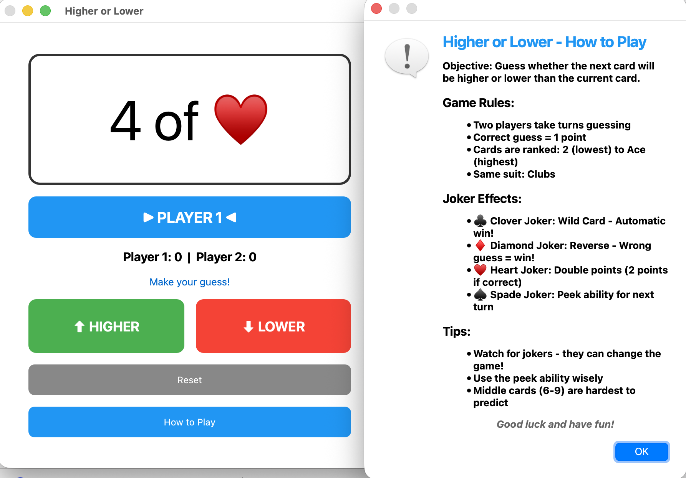
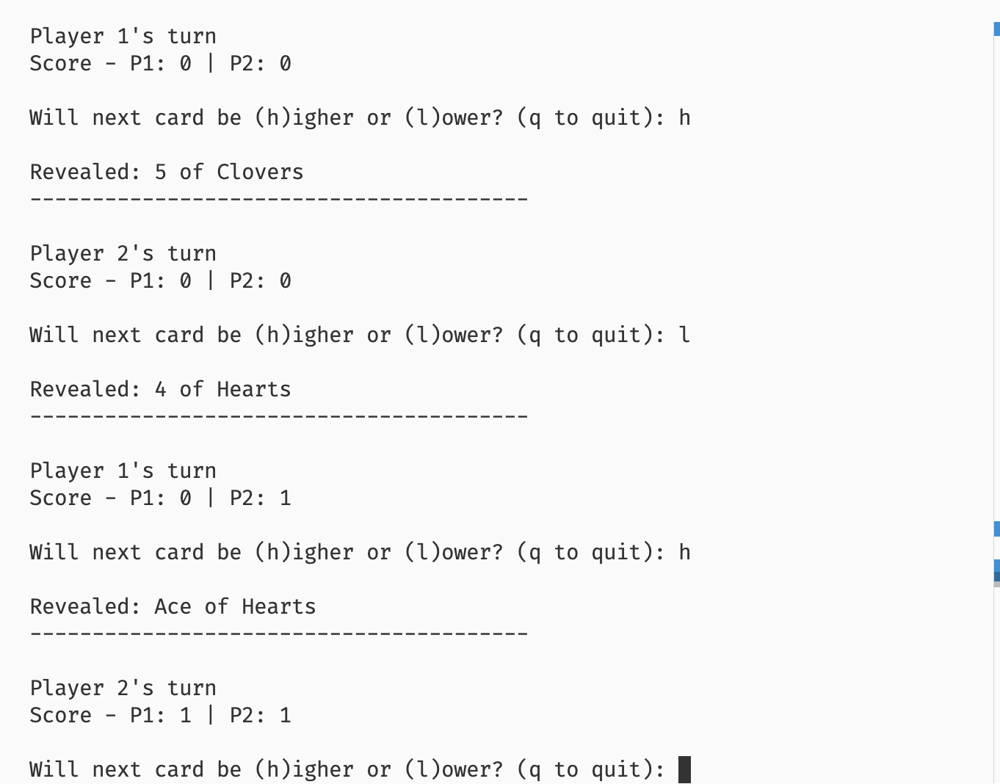

# Deck Engine - Higher or Lower Card Game

A feature-rich Higher or Lower card game demonstrating clean architecture, modern C++ practices, and cross-platform GUI development with Qt.

## Features

- Standard 52-card deck with all suits and values
- True random shuffling using C++20 `std::random_device`
- Complete Higher/Lower game logic with card comparison
- Dual interfaces: CLI and Qt5-based GUI
- 4 Jokers with unique game-changing abilities
- Two-player competitive gameplay

### Core Functionality
- Standard 52-card deck (13 ranks × 4 suits)
- 4 Jokers with unique strategic abilities
- True random shuffling using hardware entropy
- Card comparison with suit tiebreakers
- Score tracking across multiple rounds

### Joker Mechanics
Each joker has a different ability based on its suit:
- **Clover Joker:** Wild Card - Automatic win
- **Diamond Joker:** Reverse logic - Wrong guess wins
- **Heart Joker:** Double points (2 instead of 1)
- **Spade Joker:** Swaps both players' scores

### User Interfaces
- **CLI:** Fast, keyboard-driven terminal interface
- **GUI:** Modern Qt5 interface with visual feedback and color coding

## Screenshots

### GUI Version



### CLI Version



## Quick Start

### Building the Project

```bash
# Ubuntu/Debian - Install Qt5 first
sudo apt-get install qtbase5-dev qt5-qmake

# Configure and build
mkdir -p build && cd build
cmake ..
make

# Run GUI version
./deck_engine_gui

# Run CLI version
./deck_engine_cli
```

### macOS
```bash
brew install qt@5
mkdir -p build && cd build
cmake ..
make
```

### Windows
Download Qt from [qt.io](https://www.qt.io/download), then use CMake GUI or command line.

## Project Structure

```
deck-engine/
├── include/                # Public headers
│   ├── model/              # Core game logic (no dependencies)
│   │   ├── Card.hpp        # Card representation with enums
│   │   ├── Deck.hpp        # Deck management and shuffling
│   │   └── Game.hpp        # Game state and rules engine
│   ├── controller/         # UI-to-logic bridge
│   │   └── GameController.hpp
│   └── view/               # Qt GUI components
│       └── MainWindow.hpp  
├── src/                    # Implementation files
│   ├── model/              # Game logic implementation
│   ├── controller/         # Controller implementation
│   ├── view/               # GUI implementation
│   ├── main.cpp            # CLI entry point
│   └── main_gui.cpp        # GUI entry point
├── screenshots/            # Application screenshots
├── CMakeLists.txt          # Build configuration
└── README.md               # This file
```

## Architecture & Design Decisions

### Why MVC Architecture?

**Separation of Concerns**  
The project uses Model-View-Controller (MVC) to separate business logic from presentation:

1. **Model Layer** (`Card`, `Deck`, `Game`)
   - Pure C++ with zero dependencies on UI frameworks
   - All game rules, state management, and logic
   - Can be tested independently without UI
   - Reusable across different interfaces (CLI, GUI, future web)

2. **Controller Layer** (`GameController`)
   - Thin adapter between game logic and UI
   - Provides clean query methods for UI rendering
   - Shields UI from internal game state complexity
   - Makes swapping UI frameworks trivial

3. **View Layer** (`MainWindow`, CLI in main.cpp)
   - Only handles user input and visual rendering
   - No business logic - just calls controller methods
   - Framework-specific code isolated here

**Benefits:**
- Easy to add new game modes without touching UI
- Can swap Qt for another framework easily
- Testable game logic without GUI dependencies
- Multiple UIs share the same game engine

### Why Qt5 for GUI?

**Cross-Platform Native Performance**
- Works on Windows, macOS, Linux with native look
- Better performance than web-based frameworks
- Professional appearance out of the box
- Industry standard for C++ desktop applications

**Memory Management**
- Qt's parent-child ownership model prevents leaks
- No manual `delete` calls needed
- RAII principles throughout

**Rich Widget Library**
- Built-in buttons, labels, layouts
- Signal-slot system for clean event handling
- Easy styling with CSS-like syntax

### Why 4 Jokers Instead of 2?

Extended the requirement to demonstrate:
- **Strategic depth:** Each suit has different gameplay effect
- **Game variety:** No two joker encounters are the same
- **Architecture flexibility:** Easy to add more special cards
- **C++ enum usage:** Clean mapping of suits to abilities

This shows ability to enhance requirements while maintaining clean code.

### Why C++20?

**Modern Language Features:**
- `enum class` for type-safe card values/suits
- `std::random_device` for cryptographically random shuffling
- Const correctness throughout for safety
- Move semantics for efficient deck operations
- Strong typing prevents common card game bugs

### Game Rules Design

**Card Ranking System:**
- Numeric values: 2 (lowest) to 10
- Face cards: Jack (11), Queen (12), King (13), Ace (14)
- Suit tiebreaker: ♣️ < ♦️ < ♥️ < ♠️

**Why suit tiebreakers?**  
Without them, equal value cards have no comparison, making gameplay ambiguous. This adds subtle strategy.

**Why active joker effects?**  
Makes jokers exciting discoveries rather than dead cards, keeping gameplay engaging.

## Game Rules

### Basic Gameplay
1. Game starts with a visible current card
2. Active player guesses if next card is **higher** or **lower**
3. Next card is drawn and compared
4. Correct guess = 1 point (or 2 with Heart Joker)
5. Players alternate turns
6. Game continues until deck runs out

### Card Comparison
- **Rank:** 2 < 3 < ... < 10 < Jack < Queen < King < Ace
- **Tiebreaker:** If ranks equal, Clubs < Diamonds < Hearts < Spades
- **Example:** 7 of Diamonds is higher than 7 of Clubs

### Joker Special Abilities
When a joker appears as the **next card**, its ability triggers:

| Joker | Ability | Effect |
|-------|---------|--------|
| Clover | Wild Card | Automatic win regardless of guess |
| Diamond | Reverse | Wrong guess becomes correct |
| Heart | Double Points | Win awards 2 points instead of 1 |
| Spade | Score Swap | Both players' scores are swapped |

**Strategic Note:** Spade Joker can dramatically change game state - trailing player can suddenly lead!

## Technical Implementation

### Key Classes

**`Card`** - Immutable card representation
- `enum class Value` - Type-safe card values (Ace, King, ..., 2, Joker)
- `enum class Suit` - Type-safe suits (Hearts, Spades, Diamonds, Clovers)
- Comparison operators for game logic
- `toString()` for display formatting

**`Deck`** - Card collection manager
- Creates standard 52-card deck + 4 jokers
- Shuffles using `std::random_device` (hardware entropy)
- Draws cards without replacement
- Detects empty deck condition

**`Game`** - Core game engine
- Maintains game state (current card, scores, active player)
- Implements Higher/Lower comparison logic
- Handles all 4 joker effects
- Tracks game history for feedback

**`GameController`** - UI adapter
- Wraps `Game` with query methods
- Provides UI-friendly state access
- Decouples game logic from presentation
- Makes UI framework swappable

**`MainWindow`** - Qt5 GUI
- Responsive card display with emoji suits
- Color-coded player turn indicators
- Visual feedback for correct/incorrect guesses
- In-game instructions dialog

### Build System

**CMake Configuration:**
- Separate targets for CLI and GUI executables
- Shared `game_logic` static library for code reuse
- Automatic Qt MOC (Meta-Object Compiler) integration
- Clean dependency management

## Future Improvements

### Gameplay Enhancements
1. **Difficulty Levels**
   - Easy: Show next card rank
   - Medium: Current gameplay
   - Hard: No current card visible
   
2. **Additional Game Modes**
   - Streak mode: See how many you can get right in a row
   - Time attack: Score within time limit
   - Multiplayer online: Network play

3. **More Special Cards**
   - Red/Black jokers with different abilities
   - "Peek" cards that show next card
   - "Shield" cards that protect from score swaps

### Technical Improvements
1. **Unit Tests**
   - Google Test framework for game logic
   - Mock controller for UI testing
   - CI/CD pipeline integration

2. **Save/Load Game State**
   - JSON serialization of game state
   - Resume interrupted games
   - Game history/statistics tracking

3. **Enhanced GUI**
   - Card animations for draws
   - Sound effects for feedback
   - Theme customization
   - Accessibility features (screen reader support)

4. **Performance Optimization**
   - Profiling with Valgrind/perf
   - Memory pool for card objects
   - Lazy evaluation for complex comparisons

5. **Code Quality**
   - Clang-tidy static analysis
   - AddressSanitizer for memory safety
   - Documentation with Doxygen
   - Code coverage reporting

### Alternative Implementations
- **Web Version:** Compile to WebAssembly with Emscripten
- **Mobile:** Qt for Android/iOS
- **Terminal UI:** ncurses for enhanced CLI experience
- **AI Player:** Implement optimal strategy bot

## Why This Approach?

**Demonstrates Professional Development Practices:**
- Clean architecture that scales
- Modern C++ best practices
- Cross-platform compatibility
- Extensible design for future features
- Clear separation of concerns
- Production-ready code organization

**Shows Initiative:**
- Exceeded requirements (4 jokers vs 2)
- Added two-player mode unprompted
- Professional documentation
- Both CLI and GUI implementations
- Thoughtful UX design

This implementation demonstrates:
- Maintainable software architecture
- Clean, readable C++ code
- Feature-rich design with code quality balance
- Cross-platform application development
- Clear technical documentation

---

**Built with:** C++20, Qt5, CMake  
**Tested on:** Ubuntu 24.04 LTS
